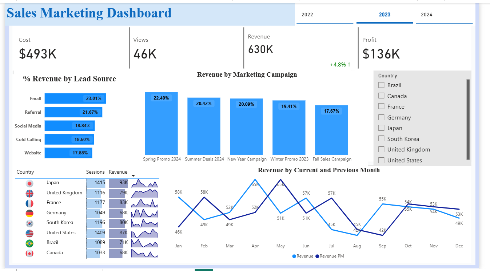
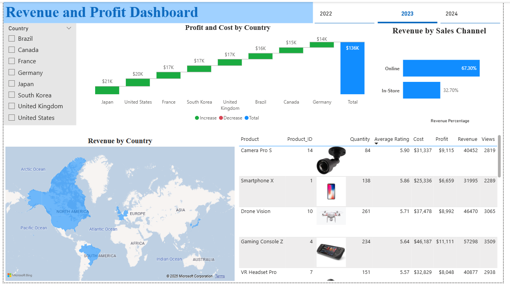

# Power BI Sales & Revenue Dashboards  

This repository contains interactive Power BI dashboards built to analyze sales, marketing campaigns, and revenue performance.  

---

## Dashboards  

### 1. Sales Marketing Dashboard  
  

**Key Insights:**  
- **KPIs:** Cost ($54K), Views (5K), Revenue (68K), Profit ($14K)  
- **% Revenue by Lead Source:** Email, Referral, Cold Calling, Website, Social Media  
- **Revenue by Marketing Campaign:** Spring Promo, Summer Deals, Fall Sales, Winter Promo, New Year Campaign  
- **Revenue by Country:** Sessions, revenue, and trends per geography  
- **Monthly Trends:** Revenue comparison between current and previous month  

---

### 2. Revenue & Profit Dashboard  
  

**Key Insights:**  
- **Profit and Cost by Country** (with drill-down to Germany in example)  
- **Revenue by Sales Channel:** Online vs In-Store contribution  
- **Revenue by Country (Map):** Geographic visualization of revenue distribution  
- **Product-Level Analysis:** Profit, cost, revenue, and views by product (e.g., VR Headset Pro, Desktop PC Ultra, Gaming Console Z)  

---

## Project Structure  
```bash
powerbi-sales-dashboard/
│── Sales_Marketing_Dashboard.pbix # Power BI project file
│── sales_data.xlsx # Sample dataset
│── screenshots/
│ ├── Sales_Marketing_Dashboard.png
│ ├── Revenue & Profit Dashboard.png
│── README.md # Project documentation
```


---

## 🛠️ Tools & Tech  

- **Power BI Desktop** for data modeling and visualization  
- **Data Sources:** Fact and dimension tables (`sales_data`, `dimProduct`, `dimSalesChannels`, `dimCountry`, etc.)  
- **DAX Measures** for KPIs (Revenue, Profit, Sessions, etc.)  

---

## 📌 How to Use  

1. Clone this repo:  
   ```bash
   git clone https://github.com/RashmiLnu/powerbi-sales-dashboard.git


2. Open the Sales_Marketing_Dashboard.pbix file in Power BI Desktop

3. Refresh data sources if needed

## Features

- Multi-dashboard analysis (Sales & Profit)

- Interactive slicers for Year and Country

- Product-level drill-down for profitability

- Campaign ROI and trend analysis

- Geographic revenue distribution (map view)

  
